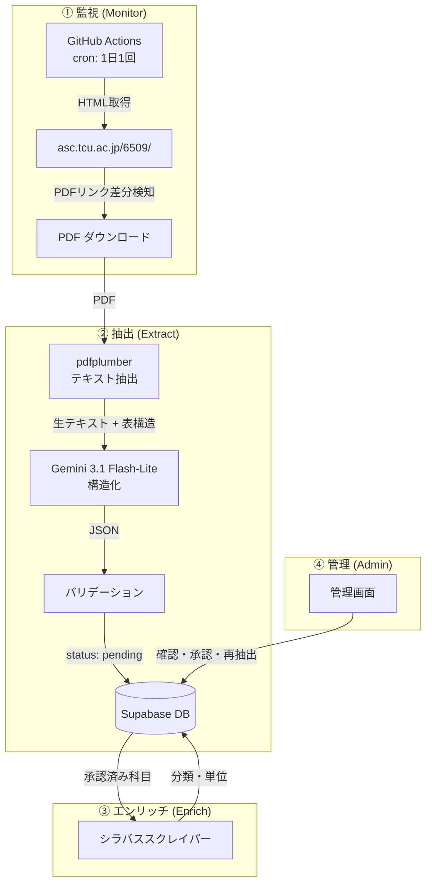
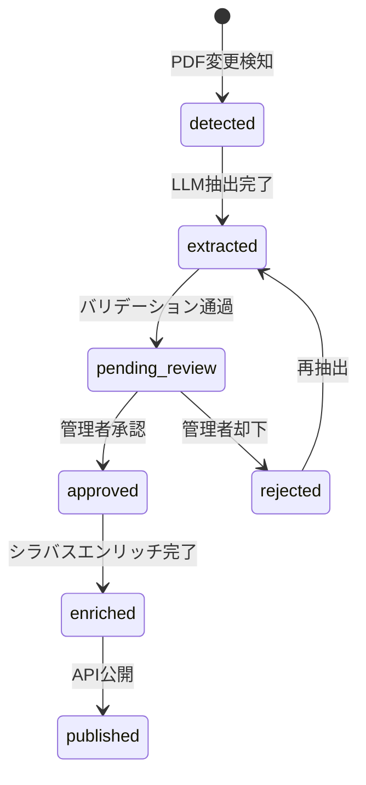

# データパイプライン設計

## 概要

レガシー版の 3 ステップ手動パイプライン（GAS → スプレッドシート → Python）を、LLM を活用した自動パイプラインに置き換える。



---

## ① Website Monitor (`pipeline/monitor.py`)

### 対象サイト

- URL: `https://www.asc.tcu.ac.jp/6509/`
- WordPress 形式のページ、学部・大学院の PDF リンクを掲載
- PDF URL パターン: `https://www.asc.tcu.ac.jp/wp-content/uploads/YYYY/MM/{hash}.pdf`
- ページタイトルに更新日表示: `（後期情報 11/27更新）`

### 監視対象 PDF（初期スコープ）

| 区分 | PDF |
|---|---|
| 総合理工学研究科 前期 | 全専攻 前期 授業時間表 |
| 総合理工学研究科 後期 | 全専攻 後期 授業時間表 |
| 変更一覧 | 授業時間表変更一覧（随時更新） |

### 検知ロジック

```python
def monitor():
    html = fetch("https://www.asc.tcu.ac.jp/6509/")
    current_links = extract_pdf_links(html, filter="総合理工学研究科")
    stored_links = db.get_stored_pdf_links()

    for link in current_links:
        if link.url not in stored_links:
            # 新規 PDF
            download_and_queue(link)
        elif link.url in stored_links and hash(download(link)) != stored_links[link.url].hash:
            # 同一 URL だが内容変更
            download_and_queue(link)
```

### トリガー条件

| 条件 | アクション |
|---|---|
| 新しい PDF URL を検知 | ダウンロード → 全抽出 |
| 同一 URL で内容変更（ハッシュ不一致） | 再ダウンロード → 再抽出 |
| 変更一覧 PDF 更新 | ダウンロード → 差分適用 |
| 手動トリガー（管理画面から） | 任意の PDF を再抽出 |

### 実行スケジュール

- **GitHub Actions cron**: 1 日 1 回（例: 毎日 06:00 JST）
- **手動ディスパッチ**: `workflow_dispatch` で任意タイミング実行可
- **所要時間**: 通常 1〜2 分（変更なければ即終了）

---

## ② LLM PDF 抽出 (`pipeline/extractor.py`)

### ハイブリッドアプローチ

TCU の時間割 PDF は機械生成（スキャン画像ではない）のため、テキスト埋め込みが利用可能。

```
PDF ──→ pdfplumber ──→ 生テキスト + 表構造 ──→ LLM ──→ 構造化 JSON
         (無料・高速)    (セル配置を保持)          (文脈理解)
```

| アプローチ | メリット | デメリット |
|---|---|---|
| 純粋ビジョン（PDF → 画像 → LLM） | シンプル | 高コスト（画像トークン）、セル境界の幻覚 |
| 純粋テキスト（pdfplumber のみ） | 無料・高速・正確 | 結合セル、複雑レイアウトに弱い |
| **ハイブリッド** ✅ | 両方の長所 | 若干コード量増 |

**ハイブリッドのメリット**: テキストで送信するため画像の 10 分の 1 のトークンコスト。

### 使用モデル

| モデル | 用途 |
|---|---|
| **Gemini 3.1 Flash-Lite** | メインモデル — 最速・低コスト・Gemini 3 シリーズ最新 |
| Gemini 2.5 Flash | フォールバック — 3.1 で品質不足の場合 |

### PDF 構造（総合理工学研究科）

18 ページの PDF:

| ページ | 内容 |
|---|---|
| 1 | 表紙 + 履修登録日程 |
| 2 | 注意事項 |
| 3 | 学事暦 |
| 4 | イベント日程 |
| 5–6 | 共同原子力専攻スケジュール |
| **7–9** | **前期 科目テーブル（12 列、〜150 行）** |
| **10–12** | **後期 科目テーブル（12 列、〜150 行）** |
| 13–18 | マニュアル、キャンパスマップ |

### テーブル列（12 列）

| 列 | 名前 | 例 | 備考 |
|---|---|---|---|
| 1 | 学科 | `院総` | 多くは None（結合セル） |
| 2 | 曜 | `月`, `火` | 前行引き継ぎの場合 None |
| 3 | 限 | `1`–`5` | 同上 |
| 4 | 学期 | `前期前`, `前期後`, `前期`, `前集中` | 同上 |
| 5 | 年 | `1` | 大学院はほぼ 1 |
| 6 | クラス | （通常空） | |
| 7 | 科目名 | `ロボティクス特論` | |
| 8 | 担当者 | `佐藤 大祐` | 複数人は改行区切り |
| 9 | 講義コード | `smab020161` | ユニーク識別子 |
| 10 | 教室 | `22A`, `渋谷サテライトクラス` | |
| 11 | 受講対象 | `対象[09情報]` | `対象[XX 専攻名]` 形式 |
| 12 | 備考 | `対開講(月1,木1)` | 対開講情報など |

### 結合セルの処理

pdfplumber は結合セルを `None` として返す。抽出後に carry-forward ロジックを適用:

```python
def carry_forward(rows):
    prev = {}
    for row in rows:
        for col in ["学科", "曜", "限", "学期", "年"]:
            if row[col] is None:
                row[col] = prev.get(col)
            else:
                prev[col] = row[col]
    return rows
```

### LLM プロンプト戦略

```
以下は東京都市大学の授業時間表から pdfplumber で抽出したテーブルデータです。
各行を JSON オブジェクトとして構造化してください。

出力スキーマ:
{
  "code": "smab020161",
  "name": "ロボティクス特論",
  "instructors": ["佐藤 大祐"],
  "day": "月",
  "period": 1,
  "term": "前期後",
  "year_level": 1,
  "class_section": "",
  "room": "22A",
  "target_raw": "対象[02機械]",
  "paired_slots": "対開講(月1,木1)",
  "notes": ""
}

入力テーブル:
{extracted_text}
```

### バリデーション

| チェック項目 | ルール |
|---|---|
| 講義コード | `sm[a-z]{2}[0-9]{6}` 形式 |
| 曜日 | `月`, `火`, `水`, `木`, `金`, `土` のいずれか |
| 時限 | 1–5 の整数 |
| 学期 | 許容値リスト内 |
| 担当者 | 空でないこと |
| 重複チェック | 同一コードの二重登録防止 |

---

## ③ シラバスエンリッチ (`pipeline/enricher.py`)

### シラバスデータの必要性

PDF 時間割には分類（専門/共通等）と単位数の情報が含まれない。これらはシラバスページから科目ごとにスクレイピングする。

> **注**: 大学院シラバスでは必修/選択（compulsoriness）は常に null のため取得対象外。カリキュラムコードによるメタデータの差異もないため、1 科目 1 回のスクレイピングに簡略化済み。

### シラバス API

```
GET https://websrv.tcu.ac.jp/tcu_web_v3/slbssbdr.do
  ?value(risyunen)=2025          # 年度
  &value(semekikn)=1             # 学期フラグ
  &value(kougicd)={course_code}   # 例: smab020161
```

レスポンス: HTML ページ、`<table class="syllabus_detail">` 内:
- `■分類■` 行: 分類 (例: `専門`)
- 単位数行: 単位数 (例: `2`)

### スクレイピングロジック

```python
for course in courses_needing_enrichment:
    fields = scrape_syllabus(year=2025, code=course.code)
    db.upsert_metadata(course.id, "default", {
        "category": fields.category,
        "credits": fields.credits,
    })
    time.sleep(3)  # レート制限
```

### エンリッチフィールド

| フィールド | 型 | 例 |
|---|---|---|
| `category` | text | `専門`, `共通`, `英語` |
| `credits` | decimal | `2.0`, `0.5` |

### TLS 対応

`websrv.tcu.ac.jp` は古い TLS 設定のため、Python `requests` でアクセス時に TLS エラーが発生する場合がある:

```python
import requests
import urllib3
urllib3.disable_warnings()

response = requests.get(url, verify=False, headers=headers)
# または、カスタム TLS アダプターを使用
```

---

## ④ パイプライン状態管理

### 抽出ステータスフロー



### GitHub Actions ワークフロー

```yaml
# .github/workflows/pipeline.yml
name: Course Data Pipeline
on:
  schedule:
    - cron: '0 21 * * *'  # 毎日 06:00 JST (UTC+9)
  workflow_dispatch:        # 手動トリガー

jobs:
  pipeline:
    runs-on: ubuntu-latest
    steps:
      - uses: actions/checkout@v4
      - uses: actions/setup-python@v5
        with:
          python-version: '3.12'
      - run: pip install -r pipeline/requirements.txt
      - run: python -m pipeline.monitor
        env:
          SUPABASE_URL: ${{ secrets.SUPABASE_URL }}
          SUPABASE_KEY: ${{ secrets.SUPABASE_SERVICE_KEY }}
          GEMINI_API_KEY: ${{ secrets.GEMINI_API_KEY }}
      - run: python -m pipeline.extractor
      - run: python -m pipeline.enricher
```
