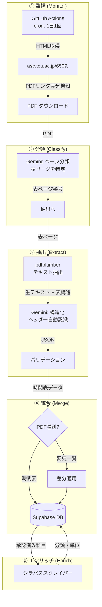
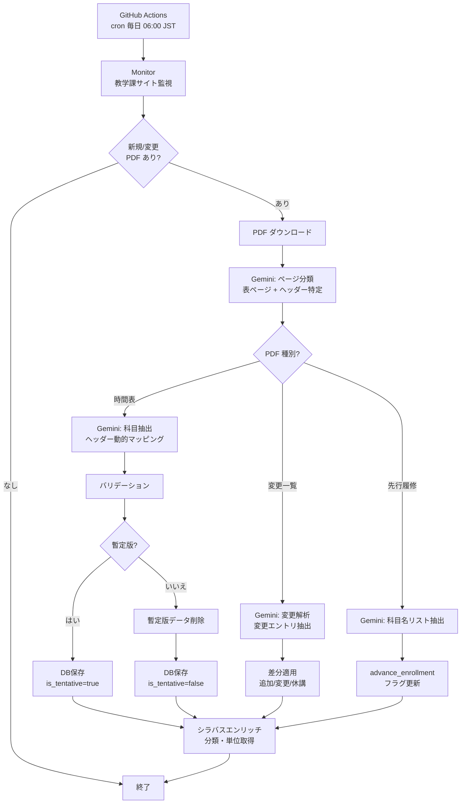

# データパイプライン設計

## 概要

レガシー版の 3 ステップ手動パイプライン（GAS → スプレッドシート → Python）を、LLM を活用した自動パイプラインに置き換える。科目データは Supabase DB に直接保存し、フロントエンドは PostgREST API 経由で取得する（静的 JSON の生成・デプロイは不要）。



---

## PDF ライフサイクル

### 年間の PDF 公開パターン

```
3月頃  ─── 初版 PDF 公開 ───────────────────────────────────
             ├── 前期 時間表 (確定)
             └── 後期 時間表 (暫定)     ───── 同一 PDF 内
                                              別ページ

4月    ─── 前期 変更一覧 (随時更新) ──────── 別 PDF

9月頃  ─── 後期 確定版 PDF 公開 ─────────── 別の新 PDF
             └── 後期 時間表 (確定)         暫定版を上書き

10月   ─── 後期 変更一覧 (随時更新) ──────── 別 PDF
```

### データの優先順位

| 優先度 | ソース | 説明 |
|---|---|---|
| **1 (最高)** | 変更一覧 PDF | 個別科目の追加・削除・変更を上書き |
| **2** | 確定版 時間表 | 後期は暫定版を完全に置換 |
| **3 (最低)** | 暫定版 時間表 | 初版 PDF 内の後期ページ |

### DB での管理

`extractions` テーブルで各 PDF を追跡:

```sql
CREATE TABLE extractions (
  id           UUID PRIMARY KEY DEFAULT gen_random_uuid(),
  pdf_url      TEXT NOT NULL,
  pdf_hash     TEXT NOT NULL,
  pdf_type     TEXT NOT NULL
               CHECK (pdf_type IN ('timetable', 'changelog', 'advance_enrollment')),
  semester     TEXT NOT NULL
               CHECK (semester IN ('spring', 'fall')),
  is_tentative BOOLEAN DEFAULT false,   -- 暫定版フラグ
  academic_year INT NOT NULL,
  status       TEXT DEFAULT 'pending'
               CHECK (status IN ('pending','extracted','pending_review',
                                  'approved','rejected')),
  raw_json     JSONB,
  error_log    TEXT,
  reviewed_by  UUID REFERENCES auth.users(id),
  created_at   TIMESTAMPTZ DEFAULT now(),
  updated_at   TIMESTAMPTZ DEFAULT now()
);
```

各科目にもソース情報を記録:

```sql
ALTER TABLE courses ADD COLUMN source_type TEXT DEFAULT 'timetable';
-- 'timetable' = 時間表から抽出
-- 'changelog' = 変更一覧から適用
ALTER TABLE courses ADD COLUMN is_tentative BOOLEAN DEFAULT false;
ALTER TABLE courses ADD COLUMN advance_enrollment BOOLEAN DEFAULT false;
-- 先行履修可能な科目
```

### 後期確定版が公開された時の処理

```python
def handle_confirmed_fall_pdf(extraction):
    """後期確定版 PDF で暫定データを完全に置換"""
    # 1. 既存の暫定版後期データを削除
    db.delete_courses(
        semester='fall',
        academic_year=extraction.academic_year,
        is_tentative=True
    )
    # 2. 確定版データを投入
    for course in extraction.courses:
        course.is_tentative = False
        db.upsert_course(course)
```

---

## ① Website Monitor (`pipeline/monitor.py`)

### 対象サイト

- URL: `https://www.asc.tcu.ac.jp/6509/`
- WordPress 形式のページ、学部・大学院の PDF リンクを掲載
- PDF URL パターン: `https://www.asc.tcu.ac.jp/wp-content/uploads/YYYY/MM/{hash}.pdf`

### PDF 種別の自動判定

リンクテキストや周辺のコンテキストから PDF の種別を推定:

```python
def classify_pdf_link(link_text: str, context: str) -> PDFMetadata:
    """リンクテキストから PDF 種別・学期を推定"""
    # パターンマッチング
    if "変更一覧" in link_text or "変更" in link_text:
        pdf_type = "changelog"
    elif "先行履修" in link_text:
        pdf_type = "advance_enrollment"
    else:
        pdf_type = "timetable"

    if "前期" in link_text:
        semester = "spring"
    elif "後期" in link_text:
        semester = "fall"
    else:
        # 両方含む場合や判定不能な場合は Gemini に判定を委譲
        semester = classify_with_gemini(link_text, context)

    return PDFMetadata(type=pdf_type, semester=semester)
```

### 検知ロジック

```python
def monitor():
    html = fetch("https://www.asc.tcu.ac.jp/6509/")
    current_links = extract_pdf_links(html, filter="総合理工学研究科")
    stored_links = db.get_stored_pdf_links()

    for link in current_links:
        metadata = classify_pdf_link(link.text, link.context)

        if link.url not in stored_links:
            download_and_queue(link, metadata)
        elif hash(download(link)) != stored_links[link.url].hash:
            download_and_queue(link, metadata)
```

### 実行スケジュール

- **GitHub Actions cron**: 1 日 1 回（毎日 06:00 JST）
- **手動ディスパッチ**: `workflow_dispatch` で任意タイミング実行可

---

## ② Gemini ページ分類 (`pipeline/classifier.py`)

> [!IMPORTANT]
> PDF のページ構成や表のヘッダーは年度・学期によって変わる可能性がある。ハードコーディングを避け、Gemini に各ページの内容を分類させる。

### なぜ必要か

| 問題 | 例 |
|---|---|
| ページ番号が変わる | 2024: 表紙 2 ページ → 2025: 表紙 3 ページ |
| 表構造が変わる | 列の追加・削除・順序変更 |
| 新セクション追加 | 新専攻の追加でページ数変動 |

### 分類フロー

```python
def classify_pages(pdf_path: str) -> list[PageClassification]:
    """各ページを Gemini で分類し、表ページとヘッダーを特定"""
    pdf = pdfplumber.open(pdf_path)

    # Phase 1: 各ページの概要を取得
    page_summaries = []
    for i, page in enumerate(pdf.pages):
        text = page.extract_text() or ""
        tables = page.extract_tables()
        has_table = len(tables) > 0
        col_count = len(tables[0][0]) if tables and tables[0] else 0
        page_summaries.append({
            "page": i + 1,
            "has_table": has_table,
            "col_count": col_count,
            "text_preview": text[:300]
        })

    # Phase 2: Gemini に一括分類させる
    prompt = f"""
以下は東京都市大学の授業時間表 PDF の各ページの概要です。
各ページの種類を分類してください。

分類カテゴリ:
- "course_table_spring": 前期の科目テーブル
- "course_table_fall": 後期の科目テーブル
- "cover": 表紙・日程
- "notes": 注意事項・学事暦
- "schedule": スケジュール表
- "map": キャンパスマップ
- "manual": マニュアル
- "other": その他

各ページの概要:
{json.dumps(page_summaries, ensure_ascii=False, indent=2)}

各 course_table のページについては、テーブルのヘッダー行
（列の並び順）も特定してください。

JSON 形式で出力:
[
  {{
    "page": 1,
    "type": "cover",
    "headers": null
  }},
  {{
    "page": 7,
    "type": "course_table_spring",
    "headers": ["学科", "曜", "限", "学期", "年", "クラス",
                "科目名", "担当者", "講義コード", "教室",
                "受講対象", "備考"]
  }}
]
"""
    return gemini.generate(prompt, response_schema=PageClassifications)
```

### 変更一覧 PDF の分類

変更一覧 PDF は時間表とは異なる構造を持つ。同様に Gemini で解析:

```python
def classify_changelog_pages(pdf_path: str) -> list[ChangelogPage]:
    """変更一覧 PDF を解析し、各変更エントリを特定"""
    # 変更一覧は通常 1〜2 ページ、表形式で:
    # | 変更種別 | 学期 | 曜日 | 時限 | 科目名 | 変更内容 |
    # のような構造
    ...
```

---

## ③ LLM PDF 抽出 (`pipeline/extractor.py`)

### ハイブリッドアプローチ

```
PDF ──→ pdfplumber ──→ 生テキスト + 表構造 ──→ LLM ──→ 構造化 JSON
         (無料・高速)    (セル配置を保持)          (文脈理解)
```

### 使用モデル

| モデル | 用途 |
|---|---|
| **Gemini 3.1 Flash-Lite** | メイン — ページ分類・構造化のすべて |
| Gemini 2.5 Flash | フォールバック — 3.1 で品質不足の場合 |

### 柔軟なヘッダーマッピング

列名をハードコードせず、分類フェーズで得たヘッダー情報を LLM プロンプトに動的に組み込む:

```python
def extract_courses(pdf_path: str, page_classifications: list) -> list[Course]:
    """分類済みページ情報を使って柔軟に抽出"""
    pdf = pdfplumber.open(pdf_path)
    all_courses = []

    for pc in page_classifications:
        if pc.type not in ("course_table_spring", "course_table_fall"):
            continue

        page = pdf.pages[pc.page - 1]
        tables = page.extract_tables()
        semester_hint = "spring" if "spring" in pc.type else "fall"

        for table in tables:
            raw_text = format_table_as_text(table)

            prompt = f"""
以下は東京都市大学の授業時間表から抽出したテーブルです。
テーブルの列ヘッダーは以下の通りです:
{json.dumps(pc.headers, ensure_ascii=False)}

各行を以下の JSON スキーマに変換してください。
ヘッダー名から適切なフィールドにマッピングしてください。
結合セルで値が空の場合は、直前の行の値を引き継いでください。

出力スキーマ:
{{
  "code": "講義コード",
  "name": "科目名",
  "instructors": ["担当者"],
  "day": "曜日 (月〜土)",
  "period": "時限 (1-5の整数)",
  "term": "学期",
  "year_level": "対象学年 (整数)",
  "class_section": "クラス",
  "room": "教室",
  "target_raw": "受講対象 (原文のまま)",
  "notes": "備考 (対開講情報含む)"
}}

入力テーブル:
{raw_text}
"""
            courses = gemini.generate(prompt, response_schema=CourseList)
            for c in courses:
                c.semester = semester_hint
            all_courses.extend(courses)

    return all_courses
```

### 結合セルの二重処理

信頼性を高めるため、pdfplumber レベルと LLM レベルの両方で結合セルを処理する:

1. **pdfplumber レベル**: Python の carry-forward ロジック（高速・確実）
2. **LLM レベル**: プロンプトに「空セルは前行の値を引き継いで」と指示（文脈理解による補完）

両方の結果を照合し、不一致があればログに記録。

### バリデーション

| チェック項目 | ルール |
|---|---|
| 講義コード | `sm[a-z]{2}[0-9]{6}` 形式 |
| 曜日 | `月`, `火`, `水`, `木`, `金`, `土` のいずれか |
| 時限 | 1–5 の整数 |
| 学期 | 許容値リスト内 |
| 担当者 | 空でないこと |
| 重複チェック | 同一コードの二重登録防止 |

---

## ④ 変更一覧の処理 (`pipeline/changelog.py`)

### 変更一覧 PDF の構造

変更一覧は時間表とは異なるフォーマットで、個別科目の変更情報を記載:

```
┌──────┬──────┬────┬────┬──────────┬────────────────┐
│ 変更  │ 学期  │ 曜  │ 限  │ 科目名    │ 変更内容         │
├──────┼──────┼────┼────┼──────────┼────────────────┤
│ 追加  │ 前期後 │ 月  │ 3  │ ○○特論   │ 新規開講          │
│ 変更  │ 前期  │ 火  │ 2  │ △△特論   │ 教室: 22A→14B    │
│ 休講  │ 前期前 │ 水  │ 1  │ □□特論   │ 担当者都合により休講 │
└──────┴──────┴────┴────┴──────────┴────────────────┘
```

### Gemini による変更解析

変更一覧のフォーマットも年度で変わる可能性があるため、Gemini で柔軟に解析:

```python
def parse_changelog(pdf_path: str) -> list[ChangeEntry]:
    """変更一覧 PDF を Gemini で解析"""
    pdf = pdfplumber.open(pdf_path)
    all_text = "\n".join(page.extract_text() or "" for page in pdf.pages)

    prompt = f"""
以下は東京都市大学の授業時間表の変更一覧です。
各変更エントリを JSON として出力してください。

出力スキーマ:
{{
  "change_type": "add | modify | cancel",
  "course_code": "講義コード (あれば)",
  "course_name": "科目名",
  "term": "学期",
  "day": "曜日",
  "period": "時限",
  "changes": {{
    "field": "変更対象フィールド",
    "old_value": "変更前の値 (あれば)",
    "new_value": "変更後の値"
  }},
  "reason": "変更理由 (あれば)"
}}

変更一覧テキスト:
{all_text}
"""
    return gemini.generate(prompt, response_schema=ChangeEntryList)
```

### 差分適用ロジック

```python
def apply_changelog(changes: list[ChangeEntry], semester: str):
    """変更一覧を既存データに適用"""
    for change in changes:
        if change.change_type == "add":
            # 新規科目: DB に挿入 (source_type = 'changelog')
            db.insert_course(change.to_course(), source_type="changelog")

        elif change.change_type == "modify":
            # 既存科目を特定して更新
            course = db.find_course(
                code=change.course_code,
                name=change.course_name,
                term=change.term,
                day=change.day,
                period=change.period
            )
            if course:
                db.update_course_fields(course.id, change.changes)
            else:
                log.warning(f"変更対象の科目が見つかりません: {change}")

        elif change.change_type == "cancel":
            # 科目を削除 (or status='cancelled' に変更)
            course = db.find_course(
                name=change.course_name,
                term=change.term
            )
            if course:
                db.mark_cancelled(course.id, reason=change.reason)
```

### 科目の特定方法

変更一覧には講義コードが含まれない場合もある。複数フィールドで照合:

| 優先度 | 照合方法 |
|---|---|
| 1 | 講義コード (完全一致) |
| 2 | 科目名 + 学期 + 曜日 + 時限 (複合一致) |
| 3 | 科目名 + 学期 (部分一致) → 候補が複数なら管理者確認 |

---

## ⑤ シラバスエンリッチ (`pipeline/enricher.py`)

PDF 時間割には分類（専門/共通等）と単位数の情報が含まれない。これらはシラバスページから科目ごとにスクレイピングする。

> **注**: 大学院シラバスでは必修/選択（compulsoriness）は常に null のため取得対象外。カリキュラムコードによるメタデータの差異もないため、1 科目 1 回のスクレイピングに簡略化済み。

### シラバス API

```
GET https://websrv.tcu.ac.jp/tcu_web_v3/slbssbdr.do
  ?value(risyunen)=2025
  &value(semekikn)=1
  &value(kougicd)={course_code}
```

レスポンス: HTML ページ、`<table class="syllabus_detail">` 内:
- `■分類■` 行: 分類 (例: `専門`)
- 単位数行: 単位数 (例: `2`)

### スクレイピングロジック

```python
for course in courses_needing_enrichment:
    fields = scrape_syllabus(year=2025, code=course.code)
    db.upsert_metadata(course.id, "default", {
        "category": fields.category,
        "credits": fields.credits,
    })
    time.sleep(3)  # レート制限
```

### TLS 対応

```python
import requests
import urllib3
urllib3.disable_warnings()
response = requests.get(url, verify=False, headers=headers)
```

---

## ⑥ 先行履修リスト処理 (`pipeline/advance.py`)

### 概要

授業時間表ページの下部に「先行履修について」のリンクで別 PDF が掲示されている。この PDF 内の表に先行履修が可能な科目の「授業科目名」がリストアップされている（授業科目区分は使用しない）。

### 抽出フロー

```python
def extract_course_names(pdf_path: str) -> list[str]:
    """先行履修 PDF から科目名リストを Gemini で抽出"""
    pdf = pdfplumber.open(pdf_path)
    all_text = "\n".join(page.extract_text() or "" for page in pdf.pages)

    prompt = f"""
以下は東京都市大学の先行履修に関する PDF から抽出したテキストです。
先行履修が可能な授業科目名をすべてリストアップしてください。
授業科目区分は不要です。科目名のみを JSON 配列で出力してください。

入力テキスト:
{all_text}
"""
    return gemini.generate(prompt, response_schema=list[str])
```

### フラグ更新ロジック

```python
def update_flags(course_names: list[str], academic_year: int):
    """先行履修フラグを一括更新"""
    # 1. 該当年度の全科目のフラグをリセット
    db.execute("""
        UPDATE courses
        SET advance_enrollment = false
        WHERE academic_year = %s
    """, [academic_year])

    # 2. 科目名で照合してフラグを設定
    for name in course_names:
        matched = db.find_courses_by_name(name, academic_year)
        if matched:
            for course in matched:
                db.execute("""
                    UPDATE courses
                    SET advance_enrollment = true
                    WHERE id = %s
                """, [course.id])
        else:
            log.warning(f"先行履修科目が見つかりません: {name}")
```

> [!NOTE]
> 科目名は PDF とデータベースで表記揺れ（全角/半角スペース等）があり得るため、正規化して照合する。

## パイプライン全体フロー



### GitHub Actions ワークフロー

```yaml
name: Course Data Pipeline
on:
  schedule:
    - cron: '0 21 * * *'  # 毎日 06:00 JST (UTC+9)
  workflow_dispatch:

jobs:
  pipeline:
    runs-on: ubuntu-latest
    steps:
      - uses: actions/checkout@v4
      - uses: actions/setup-python@v5
        with:
          python-version: '3.12'
      - run: pip install -r pipeline/requirements.txt
      - run: python -m pipeline.main
        env:
          SUPABASE_URL: ${{ secrets.SUPABASE_URL }}
          SUPABASE_KEY: ${{ secrets.SUPABASE_SERVICE_KEY }}
          GEMINI_API_KEY: ${{ secrets.GEMINI_API_KEY }}
```

### `pipeline/main.py` (オーケストレーター)

```python
def run_pipeline():
    # 1. 監視
    new_pdfs = monitor.check_for_updates()
    if not new_pdfs:
        log.info("変更なし、終了")
        return

    for pdf_info in new_pdfs:
        # 2. ページ分類
        classifications = classifier.classify_pages(pdf_info.path)

        if pdf_info.type == "timetable":
            # 3a. 時間表 → 科目抽出
            courses = extractor.extract_courses(pdf_info.path, classifications)
            validated = validator.validate(courses)
            db.save_extraction(pdf_info, validated)

        elif pdf_info.type == "changelog":
            # 3b. 変更一覧 → 差分適用
            changes = changelog.parse_changelog(pdf_info.path)
            changelog.apply_changelog(changes, pdf_info.semester)

        elif pdf_info.type == "advance_enrollment":
            # 3c. 先行履修 → 科目名リスト抽出 → フラグ更新
            course_names = advance.extract_course_names(pdf_info.path)
            advance.update_flags(course_names, pdf_info.academic_year)

        # 4. エンリッチ
        enricher.enrich_new_courses()
```
