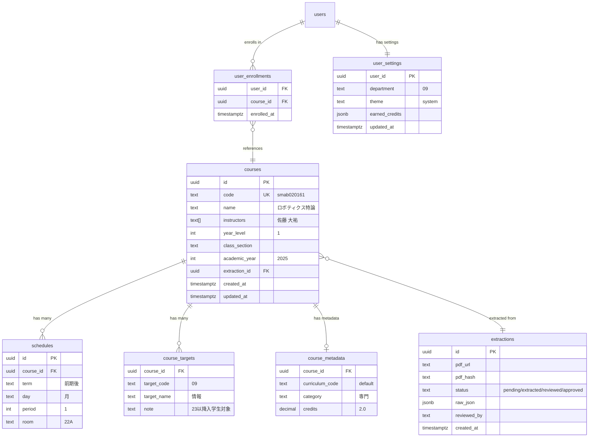

# データモデル設計

## 概要

Supabase (PostgreSQL) を使用した正規化リレーショナルスキーマ。科目データ（読み取り中心）とユーザーデータ（読み書き）を同一 DB で管理し、PostgREST による自動 REST API を活用する。

## ER 図



## SQL スキーマ

### 科目テーブル

```sql
CREATE TABLE courses (
  id            UUID PRIMARY KEY DEFAULT gen_random_uuid(),
  code          TEXT UNIQUE NOT NULL,
  name          TEXT NOT NULL,
  instructors   TEXT[] NOT NULL,
  year_level    INT DEFAULT 1,
  class_section TEXT DEFAULT '',
  academic_year INT NOT NULL,
  notes         TEXT DEFAULT '',
  extraction_id UUID REFERENCES extractions(id),
  created_at    TIMESTAMPTZ DEFAULT now(),
  updated_at    TIMESTAMPTZ DEFAULT now()
);

-- インデックス
CREATE INDEX idx_courses_code ON courses(code);
CREATE INDEX idx_courses_academic_year ON courses(academic_year);
```

### スケジュールテーブル（1 科目に複数スロット：対開講対応）

```sql
CREATE TABLE schedules (
  id         UUID PRIMARY KEY DEFAULT gen_random_uuid(),
  course_id  UUID NOT NULL REFERENCES courses(id) ON DELETE CASCADE,
  term       TEXT NOT NULL,
  day        TEXT NOT NULL CHECK (day IN ('月','火','水','木','金','土')),
  period     INT NOT NULL CHECK (period BETWEEN 1 AND 5),
  room       TEXT DEFAULT '',
  UNIQUE(course_id, term, day, period)
);

-- 時間割表示用インデックス
CREATE INDEX idx_schedules_slot ON schedules(term, day, period);
CREATE INDEX idx_schedules_course ON schedules(course_id);
```

### 受講対象テーブル

```sql
CREATE TABLE course_targets (
  course_id   UUID NOT NULL REFERENCES courses(id) ON DELETE CASCADE,
  target_code TEXT NOT NULL,
  target_name TEXT NOT NULL,
  note        TEXT DEFAULT '',
  PRIMARY KEY(course_id, target_code)
);
```

### 科目メタデータ（シラバスから取得）

```sql
CREATE TABLE course_metadata (
  id              UUID PRIMARY KEY DEFAULT gen_random_uuid(),
  course_id       UUID NOT NULL REFERENCES courses(id) ON DELETE CASCADE,
  curriculum_code TEXT NOT NULL DEFAULT 'default',
  category        TEXT,
  credits         DECIMAL(3,1),
  UNIQUE(course_id, curriculum_code)
);

CREATE INDEX idx_metadata_course ON course_metadata(course_id);
CREATE INDEX idx_metadata_curriculum ON course_metadata(curriculum_code);
```

### 抽出管理テーブル

```sql
CREATE TABLE extractions (
  id           UUID PRIMARY KEY DEFAULT gen_random_uuid(),
  pdf_url      TEXT NOT NULL,
  pdf_hash     TEXT NOT NULL,
  status       TEXT DEFAULT 'pending'
               CHECK (status IN ('pending','extracted','pending_review','approved','rejected')),
  raw_json     JSONB,
  error_log    TEXT,
  reviewed_by  UUID REFERENCES auth.users(id),
  created_at   TIMESTAMPTZ DEFAULT now(),
  updated_at   TIMESTAMPTZ DEFAULT now()
);
```

### ユーザーテーブル

```sql
-- 登録科目
CREATE TABLE user_enrollments (
  user_id    UUID NOT NULL REFERENCES auth.users(id) ON DELETE CASCADE,
  course_id  UUID NOT NULL REFERENCES courses(id) ON DELETE CASCADE,
  enrolled_at TIMESTAMPTZ DEFAULT now(),
  PRIMARY KEY(user_id, course_id)
);

-- ユーザー設定
CREATE TABLE user_settings (
  user_id         UUID PRIMARY KEY REFERENCES auth.users(id) ON DELETE CASCADE,
  department      TEXT,
  theme           TEXT DEFAULT 'system' CHECK (theme IN ('system','light','dark')),
  earned_credits  JSONB DEFAULT '{}',
  updated_at      TIMESTAMPTZ DEFAULT now()
);
```

## Row-Level Security (RLS)

```sql
-- 科目データ: 全ユーザーが閲覧可能
ALTER TABLE courses ENABLE ROW LEVEL SECURITY;
CREATE POLICY "courses_read" ON courses FOR SELECT USING (true);

-- ユーザー登録: 本人のみ CRUD
ALTER TABLE user_enrollments ENABLE ROW LEVEL SECURITY;
CREATE POLICY "enrollments_own" ON user_enrollments
  USING (auth.uid() = user_id)
  WITH CHECK (auth.uid() = user_id);

-- ユーザー設定: 本人のみ CRUD
ALTER TABLE user_settings ENABLE ROW LEVEL SECURITY;
CREATE POLICY "settings_own" ON user_settings
  USING (auth.uid() = user_id)
  WITH CHECK (auth.uid() = user_id);

-- 抽出管理: 管理者のみ
ALTER TABLE extractions ENABLE ROW LEVEL SECURITY;
CREATE POLICY "extractions_admin" ON extractions
  USING (auth.jwt() ->> 'role' = 'admin');
```

## 対開講のデータ表現

大学院では対開講（同一科目が複数コマに配置）が多い。例: `対開講(月1,木1)`

```
courses テーブル:
  id: abc-123
  code: smab020161
  name: ロボティクス特論

schedules テーブル:
  course_id: abc-123, term: 前期後, day: 月, period: 1, room: 22A
  course_id: abc-123, term: 前期後, day: 木, period: 1, room: 22A
```

1 科目に対して `schedules` に複数行を持つことで、対開講を自然に表現。時間割表示時は `schedules` を JOIN して全スロットを取得。

## レガシーとの比較

| 項目 | レガシー (data.json) | 新 (Supabase) |
|---|---|---|
| 形式 | フラット JSON | 正規化 RDB |
| period | `["月1", "木1"]` (配列) | `schedules` テーブル (1:多) |
| target | `["s21", "s22"]` (プレフィックス) | `course_targets` テーブル |
| category/credits | `Map<curriculum, value>` | `course_metadata` テーブル |
| ユーザーデータ | Firestore document | `user_enrollments` + `user_settings` |
| クエリ | クライアントサイドフィルタ | SQL (PostgREST 自動 API) |

## 年度切り替え時のクレジット繰り越し

年度が変わる際、登録済み科目を自動的に修得済み単位に計上する:

```sql
-- 年度切り替えバッチ
INSERT INTO user_settings (user_id, earned_credits)
SELECT
  ue.user_id,
  jsonb_object_agg(
    cm.category,
    COALESCE((us.earned_credits ->> cm.category)::decimal, 0) + cm.credits
  )
FROM user_enrollments ue
JOIN course_metadata cm ON cm.course_id = ue.course_id
JOIN user_settings us ON us.user_id = ue.user_id
WHERE /* 前年度の科目 */
GROUP BY ue.user_id
ON CONFLICT (user_id) DO UPDATE
SET earned_credits = EXCLUDED.earned_credits;
```

新規ユーザーや落単の場合は手動で `earned_credits` を編集可能。
