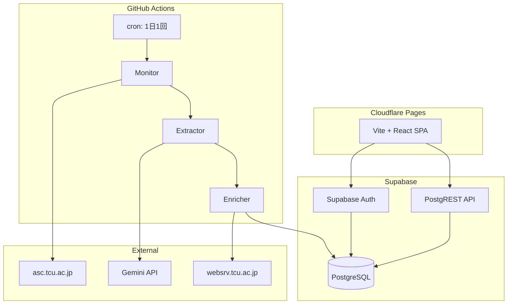
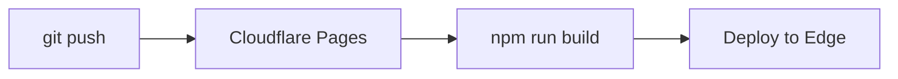
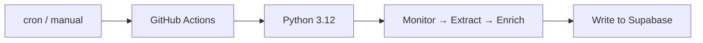

# インフラストラクチャ設計

## 概要

すべて無料枠のマネージドサービスで構成。自前サーバーなし。

## アーキテクチャ図

## サービス構成

### 1. Supabase

| 項目 | 値 |
|---|---|
| プラン | Free |
| リージョン | Northeast Asia (ap-northeast-1) |
| DB | 500MB PostgreSQL |
| Auth | Supabase Auth (メール + ソーシャル) |
| API | PostgREST (自動生成 REST) |
| 制限 | 2 アクティブプロジェクト、1 週間非アクティブでポーズ |

**非アクティブ対策**: GitHub Actions の cron (毎日実行) が Supabase API を呼び出すため、自然にキープアライブされる。

### 2. Cloudflare Pages

| 項目 | 値 |
|---|---|
| プラン | Free |
| ビルド | 500 回/月 |
| 帯域 | 無制限 |
| ドメイン | `*.pages.dev` (カスタムドメイン可) |
| デプロイ | GitHub 連携 (push → 自動ビルド) |

### 3. GitHub Actions

| 項目 | 値 |
|---|---|
| プラン | Free (パブリックリポジトリ) |
| 実行時間 | 2,000 分/月 |
| cron | 1 日 1 回 (06:00 JST) |
| 手動実行 | `workflow_dispatch` |

### 4. Gemini API

| 項目 | 値 |
|---|---|
| モデル | Gemini 3.1 Flash-Lite |
| プラン | Preview (無料枠あり) |
| 用途 | PDF テキスト → 構造化 JSON |
| 使用量 | 〜20 req/extraction × 〜1 回/週 |

## 環境構成

| 環境 | 用途 | Supabase | Cloudflare |
|---|---|---|---|
| **development** | ローカル開発 | ローカル Supabase CLI | `npm run dev` |
| **preview** | PR プレビュー | 本番共有 or ブランチ DB | Cloudflare preview URL |
| **production** | 本番 | Free プロジェクト | `*.pages.dev` |

## CI/CD

### フロントエンドデプロイ

Cloudflare Pages は GitHub 連携で自動デプロイ。PR ごとにプレビュー URL が生成される。

### パイプライン実行

## シークレット管理

| シークレット | 保存先 | 用途 |
|---|---|---|
| `SUPABASE_URL` | GitHub Secrets | Supabase API URL |
| `SUPABASE_SERVICE_KEY` | GitHub Secrets | パイプライン用サービスキー (RLS バイパス) |
| `SUPABASE_ANON_KEY` | フロントエンド env | クライアント用匿名キー |
| `GEMINI_API_KEY` | GitHub Secrets | Gemini API アクセスキー |

> **注**: `SUPABASE_ANON_KEY` はクライアントに公開されるが、RLS で保護されているため問題なし。

## ドメイン

| 環境 | URL |
|---|---|
| 本番 | `tcu-time.pages.dev` (初期) |
| カスタム | 将来的にカスタムドメイン設定可 |
| Supabase API | `https://{project-ref}.supabase.co` |

## モニタリング

| 項目 | 方法 |
|---|---|
| パイプラインエラー | GitHub Actions ログ + メール通知 |
| Supabase DB 使用量 | Supabase Dashboard |
| フロントエンドエラー | ブラウザコンソール (将来: Sentry 等) |
| API レスポンス | Supabase Dashboard → API ログ |

## セキュリティ

| 対策 | 実装 |
|---|---|
| HTTPS | Cloudflare + Supabase (自動) |
| RLS | 全テーブルに Row-Level Security ポリシー |
| Auth | Supabase Auth (JWT) |
| CORS | Supabase で許可ドメイン設定 |
| API キー分離 | anon key (クライアント) vs service key (パイプライン) |
| Rate Limiting | Supabase 組み込み |
| Admin アクセス | JWT `role` クレームで管理者判定 |

## バックアップ

| 対象 | 方法 |
|---|---|
| DB データ | Supabase 自動バックアップ (Free: 7 日間) |
| ソースコード | GitHub リポジトリ |
| PDF 原本 | リポジトリ or Supabase Storage |
| 抽出結果 (raw JSON) | `extractions.raw_json` に保存 |
