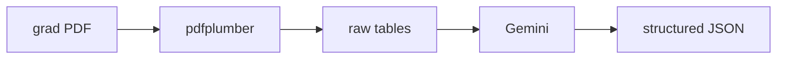

# プロジェクト構成 & 開発ロードマップ

## フォルダ構成

```
TIME/
├── Docs/                          # 設計書
│   ├── 00_overview.md
│   ├── 01_data_pipeline.md
│   ├── 02_data_model.md
│   ├── 03_frontend.md
│   ├── 04_infrastructure.md
│   └── 05_project_structure.md    # このファイル
│
├── References/                    # レガシー参考資料 (読み取り専用)
│   ├── 2024.gs                    # レガシー GAS
│   ├── 2024F.json                 # レガシー科目 JSON
│   ├── crawler2.py                # レガシーシラバスクローラ
│   ├── data.json                  # レガシーエンリッチ済みデータ
│   ├── grad_timetable_front.pdf   # 大学院時間割 PDF
│   ├── list.png / table.png       # レガシー UI スクリーンショット
│   ├── ui_documentation.md        # レガシー UI 仕様書
│   └── ...
│
├── frontend/                      # フロントエンド (Vite + React)
│   ├── src/
│   │   ├── main.tsx
│   │   ├── App.tsx
│   │   ├── index.css              # Tailwind + shadcn/ui テーマ
│   │   ├── components/
│   │   │   ├── ui/                # shadcn/ui (自動生成)
│   │   │   ├── layout/            # AppSidebar, BottomNav, Header
│   │   │   ├── course/            # CourseList, CourseCard, FilterPanel
│   │   │   ├── timetable/         # CourseGrid, GridCell, CreditsTable
│   │   │   ├── auth/              # LoginForm, ProfileView
│   │   │   └── admin/             # ExtractionList, ReviewPanel
│   │   ├── hooks/                 # use-courses, use-enrollments, ...
│   │   ├── lib/                   # supabase.ts, utils.ts, constants.ts
│   │   └── pages/                 # CoursesPage, TimetablePage, ...
│   ├── public/
│   ├── components.json
│   ├── vite.config.ts
│   ├── tsconfig.json
│   └── package.json
│
├── pipeline/                      # データパイプライン (Python)
│   ├── __init__.py
│   ├── monitor.py                 # Web サイト監視 + PDF ダウンロード
│   ├── extractor.py               # pdfplumber + Gemini 抽出
│   ├── enricher.py                # シラバススクレイピング
│   ├── models.py                  # データクラス (Pydantic)
│   ├── db.py                      # Supabase クライアント
│   ├── config.py                  # 設定 (環境変数)
│   ├── tests/
│   │   ├── test_extractor.py
│   │   ├── test_enricher.py
│   │   └── fixtures/              # テスト用 PDF、HTML サンプル
│   ├── pyproject.toml             # uv プロジェクト設定
│   └── .python-version
│
├── supabase/                      # Supabase マイグレーション
│   ├── migrations/
│   │   ├── 001_courses.sql
│   │   ├── 002_users.sql
│   │   ├── 003_extractions.sql
│   │   └── 004_rls_policies.sql
│   └── config.toml
│
├── .github/
│   └── workflows/
│       └── pipeline.yml           # データパイプライン cron (1日1回)
│
├── .gitignore
└── README.md                      # プロジェクト全体 README
```

---

## 開発フェーズ

### Phase 0: プロジェクトセットアップ (〜0.5 日)

| タスク | 詳細 |
|---|---|
| Git リポジトリ初期化 | `.gitignore` (Python + Node)、`README.md` |
| Python パイプライン初期化 | `uv init pipeline`、依存: pdfplumber, google-genai, supabase-py, requests, beautifulsoup4, pydantic |
| Supabase プロジェクト作成 | ダッシュボードで作成、接続情報取得 |
| フロントエンド追加パッケージ | `bun add react-router @supabase/supabase-js @supabase/auth-ui-react` |
| 環境変数設定 | `.env` テンプレート作成 |

---

### Phase 1: データパイプライン (〜3 日)

最優先。データがなければフロントエンドも動作確認できない。

#### Step 1-1: Extractor (1 日)



- `pipeline/extractor.py`: pdfplumber で PDF → テーブル抽出
- carry-forward ロジック (結合セル処理)
- Gemini 3.1 Flash-Lite で構造化
- Pydantic モデルでバリデーション
- **検証**: 実際の PDF で抽出結果を手動確認、正確性チェック

#### Step 1-2: DB スキーマ + 投入 (0.5 日)

- Supabase マイグレーション適用
- 抽出結果を DB に投入
- PostgREST API で科目データ取得を確認

#### Step 1-3: Enricher (1 日)

- `pipeline/enricher.py`: シラバスページスクレイピング
- カリキュラムコード一覧取得
- 科目 × カリキュラムごとに分類・必選・単位取得
- レート制限 (3 秒間隔)
- **検証**: 5 科目スポットチェック

#### Step 1-4: Monitor + GitHub Actions (0.5 日)

- `pipeline/monitor.py`: 教学課サイト監視
- `.github/workflows/pipeline.yml`: cron + workflow_dispatch
- **検証**: 手動ディスパッチでパイプライン全体を E2E 実行

---

### Phase 2: フロントエンド基盤 (〜2 日)

#### Step 2-1: レイアウト + ルーティング (0.5 日)

- React Router セットアップ
- `Layout.tsx`: AppSidebar + BottomNav + Header
- shadcn/ui Sidebar コンポーネント導入
- テーマ切替 (light/dark/system)
- 日本語フォント (M PLUS 1p) 設定

#### Step 2-2: Supabase 接続 (0.5 日)

- `lib/supabase.ts`: クライアント初期化
- `hooks/use-courses.ts`: 科目データ取得 (PostgREST)
- `hooks/use-auth.ts`: Supabase Auth

#### Step 2-3: 科目一覧画面 (1 日)

- `CourseList.tsx` + `CourseCard.tsx`
- `FilterPanel.tsx` (Sheet + Checkbox グループ)
- `SearchBar.tsx` (Command)
- 専攻セレクト
- レスポンシブ対応 (ポートレート/ランドスケープ)

---

### Phase 3: 時間割 + 単位管理 (〜2 日)

#### Step 3-1: 時間割グリッド (1 日)

- `CourseGrid.tsx`: 月〜土 × 5 時限
- `GridCell.tsx`: 空/科目/重複の 3 状態
- 対開講の同色ハイライト
- 前期/後期タブ切替
- 通年・集中セクション

#### Step 3-2: 単位トラッカー (0.5 日)

- `CreditsTable.tsx`: カテゴリ別集計
- 修得済み単位の入力
- 合計行の自動計算

#### Step 3-3: 登録・取消 (0.5 日)

- `hooks/use-enrollments.ts`: Supabase CRUD
- CourseCard / CourseDialog の登録ボタン連動
- 時間割グリッドへの即座反映

---

### Phase 4: 認証 + 管理画面 (〜1.5 日)

#### Step 4-1: 認証 (0.5 日)

- ログイン画面 (Supabase Auth UI)
- プロフィール画面
- 未ログイン時の機能制限

#### Step 4-2: 管理画面 (1 日)

- `ExtractionList.tsx`: 抽出ステータス一覧
- `ReviewPanel.tsx`: JSON diff + 承認/却下
- 再抽出トリガーボタン
- 管理者権限チェック

---

### Phase 5: デプロイ + 仕上げ (〜1 日)

| タスク | 詳細 |
|---|---|
| Cloudflare Pages 設定 | GitHub 連携、ビルドコマンド設定 |
| 環境変数設定 | Cloudflare + GitHub Secrets |
| E2E テスト | パイプライン → DB → フロントエンドの通し確認 |
| README 整備 | セットアップ手順、開発方法 |
| OGP / SEO | タイトル、description、OGP 画像 |

---

## 開発順序のまとめ

```mermaid
gantt
    title TCU-TIME 開発スケジュール
    dateFormat X
    axisFormat %d日目

    section Phase 0
    プロジェクトセットアップ       :a0, 0, 1

    section Phase 1
    Extractor (PDF → JSON)       :a1, 1, 2
    DB スキーマ + 投入            :a2, 2, 1
    Enricher (シラバス)           :a3, 3, 2
    Monitor + GitHub Actions     :a4, 4, 1

    section Phase 2
    レイアウト + ルーティング       :a5, 5, 1
    Supabase 接続                :a6, 5, 1
    科目一覧画面                  :a7, 6, 2

    section Phase 3
    時間割グリッド                 :a8, 7, 2
    単位トラッカー                :a9, 8, 1
    登録・取消                    :a10, 9, 1

    section Phase 4
    認証                         :a11, 9, 1
    管理画面                      :a12, 10, 2

    section Phase 5
    デプロイ + 仕上げ             :a13, 11, 1
```



**合計見積もり: 約 10 日**

> [!NOTE]
> Phase 1 (パイプライン) を最優先とする理由: 実データが DB に入っていないとフロントエンドの開発・検証が進められない。パイプラインが完成すれば、実データでフロントエンドを開発できる。

---

## 開発環境コマンド

```bash
# フロントエンド
cd frontend
bun install
bun run dev          # http://localhost:5173

# パイプライン
cd pipeline
uv sync
uv run python -m pipeline.extractor   # 単体テスト
uv run pytest                         # テスト実行

# Supabase (ローカル開発 - オプション)
npx supabase start
npx supabase db push
```
