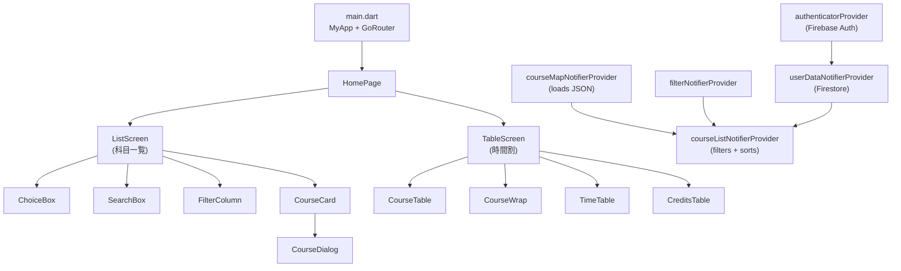

# Take it Easy — Project Summary

> **「履修登録を簡単に」** — Making course registration easier.

A **Flutter Web application** for students at **Tokyo City University (TCU)** to browse available courses, build a weekly timetable, and track credit progress — all in Japanese.

---

## Tech Stack

| Layer            | Technology                                                                                                       |
| ---------------- | ---------------------------------------------------------------------------------------------------------------- |
| Framework        | Flutter (Web target)                                                                                             |
| State Management | **Riverpod** (`flutter_riverpod`)                                                                                |
| Authentication   | Firebase Auth + Firebase UI Auth (Email + Google OAuth)                                                          |
| Database         | **Cloud Firestore** (user preferences & enrolled courses)                                                        |
| Routing          | `go_router` with path-based URL strategy                                                                         |
| Styling          | Material 3, Google Fonts (`M PLUS 1p`), light/dark theme                                                         |
| Environment      | `envied` (obfuscated [.env](file:///Users/taira/Projects/Personal/Flutter/takeiteasy/.env) for Google Client ID) |
| Hosting          | Firebase Hosting                                                                                                 |

---

## Directory Structure

```
lib/
├── main.dart                    # App entry, routing, theme, navigation shell
├── firebase_options.dart        # Auto-generated Firebase config
├── env/
│   ├── env.dart                 # Envied config (webGoogleClientId)
│   └── env.g.dart               # Generated obfuscated env
├── models/
│   ├── course.dart              # Course data model (from JSON)
│   ├── filter.dart              # Filter state model
│   └── user_data.dart           # User preferences model
├── providers/
│   ├── course_list_provider.dart # Course loading & filtering logic
│   ├── filter_provider.dart     # Filter state notifier
│   └── user_data_provider.dart  # Auth + Firestore user data
├── screens/
│   ├── list_screen.dart         # Course list view
│   └── table_screen.dart        # Timetable + credits view
└── widgets/
    ├── choice_box.dart          # Curriculum selector dropdown
    ├── course_card.dart         # Course list item card
    ├── course_dialog.dart       # Course detail dialog
    ├── credits_table.dart       # Credit tracking table
    ├── filter_column.dart       # Filter sidebar/bottom-sheet
    ├── search_box.dart          # Course search with suggestions
    └── time_table.dart          # Weekly timetable grid
```

**Total:** 17 Dart source files (~2,340 lines)

---

## Architecture Overview



---

## Data Models

### [Course](file:///Users/taira/Projects/Personal/Flutter/takeiteasy/lib/models/course.dart#1-38) ([course.dart](file:///Users/taira/Projects/Personal/Flutter/takeiteasy/lib/models/course.dart))

Parsed from a bundled [assets/data.json](file:///Users/taira/Projects/Personal/Flutter/takeiteasy/assets/data.json) file. Represents a single university course:

| Field                   | Type                      | Description                                    |
| ----------------------- | ------------------------- | ---------------------------------------------- |
| `period`                | `List<String>`            | Time slots (e.g.`["月1"]` = Monday 1st period) |
| `term`                  | `String`                  | Semester (`前期`, `後期`, `通年`, etc.)        |
| `grade`                 | `int`                     | Target year (1–4)                              |
| `class_`                | `String`                  | Class section                                  |
| `name`                  | `String`                  | Course name                                    |
| `lecturer`              | `List<String>`            | Instructor(s)                                  |
| `code`                  | `String`                  | Unique course code                             |
| `room`                  | `List<String>`            | Classroom(s)                                   |
| `target`                | `List<String>`            | Target curriculum codes                        |
| `note`                  | `String`                  | Notes                                          |
| `early`                 | `bool`                    | Whether the class starts at 9:00 (early)       |
| `altName` / `altTarget` | `String` / `List<String>` | Alternate name for specific curricula          |
| `category`              | `Map<String, String>`     | Category per curriculum (教養, 専門, etc.)     |
| `compulsoriness`        | `Map<String, String>`     | Required/elective per curriculum               |
| `credits`               | `Map<String, double>`     | Credit count per curriculum                    |

### [Filter](file:///Users/taira/Projects/Personal/Flutter/takeiteasy/lib/models/filter.dart#1-54) ([filter.dart](file:///Users/taira/Projects/Personal/Flutter/takeiteasy/lib/models/filter.dart))

Immutable filter state with [copyWith](file:///Users/taira/Projects/Personal/Flutter/takeiteasy/lib/models/filter.dart#38-53):

- **`searchQuery`** — text search
- **`enrolledOnly`** — show only enrolled courses
- **`blankOnly`** — show only courses that fit into empty slots
- **`internationalSpecified`** — filter for international course students
- **`filters`** — multi-dimensional Map for 学年, 学期, 分類, 必選

### [UserData](file:///Users/taira/Projects/Personal/Flutter/takeiteasy/lib/models/user_data.dart#1-26) ([user_data.dart](file:///Users/taira/Projects/Personal/Flutter/takeiteasy/lib/models/user_data.dart))

Persisted to Firestore per user:

- **`themeModeIndex`** — light / dark / system
- **`crclumcd`** — selected curriculum code (e.g. `s24310`)
- **`enrolledCourses`** — list of enrolled course codes
- **`tookCredits`** — previously earned credits by category

---

## Providers (State Management)

All state is managed via **Riverpod** notifiers:

| Provider                     | Type                                                 | Role                                                                                                                             |
| ---------------------------- | ---------------------------------------------------- | -------------------------------------------------------------------------------------------------------------------------------- |
| `authProvider`               | `StateProvider`                                      | `FirebaseAuth.instance`                                                                                                          |
| `authenticatorProvider`      | `StateNotifierProvider<AuthController, User?>`       | Listens to `userChanges()` stream                                                                                                |
| `fireStoreProvider`          | `StateProvider`                                      | `FirebaseFirestore.instance`                                                                                                     |
| `userDataNotifierProvider`   | `AsyncNotifierProvider<UserDataNotifier, UserData>`  | Loads/saves user prefs to Firestore                                                                                              |
| `courseMapNotifierProvider`  | `AsyncNotifierProvider`                              | Loads[assets/data.json](file:///Users/taira/Projects/Personal/Flutter/takeiteasy/assets/data.json) → `Map<String, List<Course>>` |
| `courseListNotifierProvider` | `NotifierProvider<CourseListNotifier, List<Course>>` | Filters courses by curriculum, search, filters                                                                                   |
| `filterNotifierProvider`     | `NotifierProvider<FilterNotifier, Filter>`           | Manages filter UI state                                                                                                          |

**Key data flow:**

1. `courseMapNotifierProvider` loads all courses from bundled JSON on startup
2. `courseListNotifierProvider` watches the course map, user data (curriculum), and filter state
3. Courses are filtered to match the user's selected curriculum code, then sorted by day/period/term
4. Additional filtering is applied via search, enrolled-only, blank-only, and multi-dimensional checkbox filters

---

## Screens & Navigation

### Routing ([main.dart](file:///Users/taira/Projects/Personal/Flutter/takeiteasy/lib/main.dart))

- `/` → [HomePage](file:///Users/taira/Projects/Personal/Flutter/takeiteasy/lib/main.dart#122-129) (main shell with navigation)
- `/login` → Firebase UI `SignInScreen` (Email + Google)
- `/profile` → Firebase UI `ProfileScreen`

### HomePage Navigation

Uses `IndexedStack` for tab persistence:

- **Portrait mode**: Bottom `NavigationBar`
- **Landscape mode**: Expandable [NavigationRail](file:///Users/taira/Projects/Personal/Flutter/takeiteasy/lib/main.dart#476-518) (hover to expand)

Two tabs:

1. **科目一覧 (Course List)** → [ListScreen](file:///Users/taira/Projects/Personal/Flutter/takeiteasy/lib/screens/list_screen.dart#12-132)
2. **時間割 (Timetable)** → [TableScreen](file:///Users/taira/Projects/Personal/Flutter/takeiteasy/lib/screens/table_screen.dart#9-218)

### ListScreen ([list_screen.dart](file:///Users/taira/Projects/Personal/Flutter/takeiteasy/lib/screens/list_screen.dart))

- Floating `SliverAppBar` with curriculum selector ([ChoiceBox](file:///Users/taira/Projects/Personal/Flutter/takeiteasy/lib/widgets/choice_box.dart#5-55)) and search bar ([SearchBox](file:///Users/taira/Projects/Personal/Flutter/takeiteasy/lib/widgets/search_box.dart#6-12))
- Portrait: filter button opens `ModalBottomSheet` with [FilterColumn](file:///Users/taira/Projects/Personal/Flutter/takeiteasy/lib/widgets/filter_column.dart#7-17)
- Landscape: persistent [FilterColumn](file:///Users/taira/Projects/Personal/Flutter/takeiteasy/lib/widgets/filter_column.dart#7-17) sidebar (200px)
- `ListView.builder` renders [CourseCard](file:///Users/taira/Projects/Personal/Flutter/takeiteasy/lib/widgets/course_card.dart#9-299) for each filtered course

### TableScreen ([table_screen.dart](file:///Users/taira/Projects/Personal/Flutter/takeiteasy/lib/screens/table_screen.dart))

- `TabBar` with 前期 (Spring) / 後期 (Fall) tabs
- Each tab shows:
  - [TimeTable](file:///Users/taira/Projects/Personal/Flutter/takeiteasy/lib/widgets/time_table.dart#212-320) — reference grid of class start/end times
  - [CourseTable](file:///Users/taira/Projects/Personal/Flutter/takeiteasy/lib/widgets/time_table.dart#5-81) — 6×5 timetable grid of enrolled courses (前半/後半 sub-terms)
  - [CourseWrap](file:///Users/taira/Projects/Personal/Flutter/takeiteasy/lib/widgets/time_table.dart#82-131) — 通年/集中 courses
  - [CreditsTable](file:///Users/taira/Projects/Personal/Flutter/takeiteasy/lib/widgets/credits_table.dart#8-258) — credit tracking by category

---

## Key Widgets

### ChoiceBox ([choice_box.dart](file:///Users/taira/Projects/Personal/Flutter/takeiteasy/lib/widgets/choice_box.dart))

`DropdownMenu` with 16 curriculum options (情科/知能 × year 21–24 × 一般/国際). Persists selection to Firestore.

### CourseCard ([course_card.dart](file:///Users/taira/Projects/Personal/Flutter/takeiteasy/lib/widgets/course_card.dart))

Responsive course list item. Shows term, period, name (linked to TCU syllabus), category, credits, and enroll/unenroll button. Tapping opens [CourseDialog](file:///Users/taira/Projects/Personal/Flutter/takeiteasy/lib/widgets/course_dialog.dart#8-155).

### CourseDialog ([course_dialog.dart](file:///Users/taira/Projects/Personal/Flutter/takeiteasy/lib/widgets/course_dialog.dart))

`AlertDialog` with detailed course info table (term, period, grade, class, category, credits, lecturer, room, etc.) plus enroll/unenroll action.

### CreditsTable ([credits_table.dart](file:///Users/taira/Projects/Personal/Flutter/takeiteasy/lib/widgets/credits_table.dart))

Summarizes credits by 7 categories (教養, 体育, 外国語, PBL, 情報工学基盤, 専門, 教職). Spring term allows editing "previously earned" credits. Computes semester + cumulative totals.

### FilterColumn ([filter_column.dart](file:///Users/taira/Projects/Personal/Flutter/takeiteasy/lib/widgets/filter_column.dart))

Multi-section filter panel with checkboxes for: 登録済み, 空きコマ, 国際コース指定 (conditional), and expandable sections for 学年, 学期, 分類, 必選.

### SearchBox ([search_box.dart](file:///Users/taira/Projects/Personal/Flutter/takeiteasy/lib/widgets/search_box.dart))

`SearchAnchor.bar` with autocomplete suggestions from course name matching.

### TimeTable + CourseTable + CourseWrap ([time_table.dart](file:///Users/taira/Projects/Personal/Flutter/takeiteasy/lib/widgets/time_table.dart))

- **[TimeTable](file:///Users/taira/Projects/Personal/Flutter/takeiteasy/lib/widgets/time_table.dart#212-320)**: Reference grid showing 5 time periods (9:20–19:00)
- **[CourseTable](file:///Users/taira/Projects/Personal/Flutter/takeiteasy/lib/widgets/time_table.dart#5-81)**: 6-column (Mon–Sat) × 5-row timetable grid. Enrolled courses shown as colored cards; overlapping courses highlighted in error color with "重複" (conflict) label
- **[CourseWrap](file:///Users/taira/Projects/Personal/Flutter/takeiteasy/lib/widgets/time_table.dart#82-131)**: Vertical list for 通年/集中 courses
- **[TableCard](file:///Users/taira/Projects/Personal/Flutter/takeiteasy/lib/widgets/time_table.dart#132-211)**: Individual timetable cell — tapping opens [CourseDialog](file:///Users/taira/Projects/Personal/Flutter/takeiteasy/lib/widgets/course_dialog.dart#8-155)

---

## Key Features Summary

1. **Curriculum-aware filtering** — Courses are filtered based on the student's specific curriculum code, showing only relevant offerings
2. **Timetable builder** — Visual weekly grid showing enrolled courses with conflict detection
3. **Credit tracker** — Category-wise credit counting with manual "previously earned" entry
4. **Smart search** — Autocomplete course search with name matching
5. **Multi-dimensional filters** — Filter by year, term, category, and compulsoriness
6. **Blank-slot finder** — Show only courses that fit into unoccupied time slots
7. **Syllabus links** — Each course links directly to the official TCU syllabus page
8. **Firebase Auth** — Email + Google sign-in, with profile management
9. **Cloud sync** — Enrolled courses, theme preference, and curriculum selection persist via Firestore
10. **Responsive design** — Portrait (mobile) and landscape (desktop) layouts with adaptive navigation
11. **Dark/Light theme** — Toggle with user preference persistence
12. **Japanese localization** — Full Japanese UI
